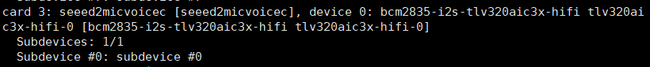
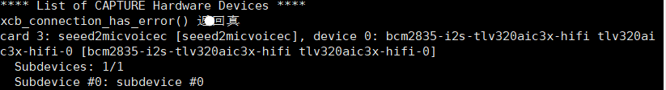

# ReSpeaker 2-Mics Pi HAT V2.0 驱动安装问题解决办法

[[English](README_en.md)] [[中文](README.md)]

之所以写这个教程,是因为折腾了了好久才解决,而且相当多的地方提供的解决方案都没有用,最后还是在官网上找到的,真是灯下黑.

下面先说正确解决方案,来源是[官网提供的V2.0驱动配置方法](https://wiki.seeedstudio.com/respeaker_2_mics_pi_hat_raspberry_v2/)

能查到的大部分教程可能都是针对V1.0或者其他产品,所以对于V2.0无法使用,原因可能是 ReSpeaker 2-Mics Pi HAT V2.0 WM8960芯片 改换为 TLV320AIC3104 导致大部分驱动不可用,而且相当多的驱动也是针对旧版系统内核.

1. **将 ReSpeaker 2-Mics Pi HAT 连接到 Raspberry Pi**
将ReSpeaker 2-Mics Pi HAT 安装在 Raspberry Pi 上，确保在堆叠 ReSpeaker 2-Mics Pi HAT 时引脚正确对齐.(尝试相当多的方案后我甚至怀疑是硬件问题,用万用表测引脚都正常,其实还是驱动安装的问题)

2. **在 Raspberry Pi 上设置驱动程序**
确保您在 Pi 上运行最新的 Raspberry Pi作系统.(更新于 2024.11.19)
>  亲测 2025.5.13 更新的Raspberry Pi OS (64-bit) 可行,按理说这个方法应该是针对新版的 (Legacy的 /boot/firmware/overlays 路径不同,会报错,但不清楚改为 /boot/overlays 后是否可行)

###  硬件配置
**步骤1**：获取 ReSpeaker 2-Mics Pi HAT (V2.0) 的设备树源 (DTS)，编译并安装设备树覆盖.
```
curl https://raw.githubusercontent.com/Seeed-Studio/seeed-linux-dtoverlays/refs/heads/master/overlays/rpi/respeaker-2mic-v2_0-overlay.dts -o respeaker-2mic-v2_0-overlay.dts
dtc -I dts respeaker-2mic-v2_0-overlay.dts -o respeaker-2mic-v2_0-overlay.dtbo
sudo dtoverlay respeaker-2mic-v2_0-overlay.dtbo
sudo cp respeaker-2mic-v2_0-overlay.dtbo /boot/firmware/overlays
```
>如果raw.githubusercontent.com访问超时,修改sudo nano /etc/hosts,查询IP并添加以下:
><br>185.199.108.133 raw.githubusercontent.com<br>
>185.199.109.133 raw.githubusercontent.com<br>
>185.199.110.133 raw.githubusercontent.com<br>
>185.199.111.133 raw.githubusercontent.com

**或者**
实在是无法下载就直接从项目里拷贝
```
curl https://raw.githubusercontent.com/Seeed-Studio/seeed-linux-dtoverlays/refs/heads/master/overlays/rpi/respeaker-2mic-v2_0-overlay.dts -o respeaker-2mic-v2_0-overlay.dts
dtc -I dts respeaker-2mic-v2_0-overlay.dts -o respeaker-2mic-v2_0-overlay.dtbo
sudo dtoverlay respeaker-2mic-v2_0-overlay.dtbo
sudo cp respeaker-2mic-v2_0-overlay.dtbo /boot/firmware/overlays
```


**步骤2**： 编辑`/boot/firmware/config.txt`并添加以下行：
```
dtoverlay=respeaker-2mic-v2_0-overlay
dtoverlay=i2s-mmap
```
>注意：如果您的内核版本大于 4.0，则无需添加 .dtoverlay=i2s-mmap

**步骤3**：重新启动 Pi.
```
sudo reboot
```
**步骤4**： 检查设备是否被检测到.
```
apaly -l
arecord -l
```

输出结果如下,看到seeed2mic就行了





# 其他不可用的方案
### 1.常规的官网解决方案
比如CSDN或者[github上的官方库](https://github.com/respeaker/seeed-voicecard)
```
git clone https://github.com/respeaker/seeed-voicecard
cd seeed-voicecard
sudo ./install.sh
sudo reboot
```
或者`sudo ./install.sh`加上参数什么的,后面都会报kernel version的问题,而且能下载的内核包最新也就6.1,这时候就不用去找新的内核包了,没有用.

### 2.为了兼容内核版本的解决方案
应该是有两个方案,一个是可以[兼容各版本内核](https://github.com/HinTak/seeed-voicecard/tree/v6.12)的驱动安装,另一个是在官方论坛找到的YouTube介绍的项目包含的驱动安装,[Wyoming Satellite](https://github.com/rhasspy/wyoming-satellite/tree/master/docs),当然结果是都不行,即使成功安装也是无法识别设备,可能的原因是驱动都是针对WM8960芯片,而V2.0的板子已经改成TLV320AIC3104了.

### 3.官方论坛的各种解决方案
有很多帖子都提到相关的问题,甚至一模一样的错误，但是没有给出解决方案，有一篇提到了TLV320AIC3104,但也是言之不明,给的也是官方库.

### 4.其他的方法
包括但不限于降级内核,尝试不同32位64位系统版本,都没有作用.如果有其他方法也可以补充.
