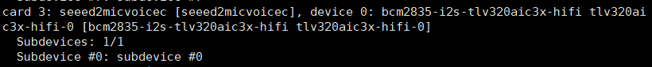
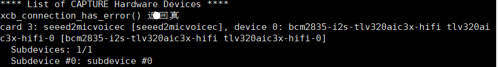

# Solution for ReSpeaker 2-Mics Pi HAT V2.0 Driver Installation Issues

[[English](README_en.md)] [[Chinese](README.md)]

I'm writing this guide because it took me an absurdly long time to solve this problem. Most solutions I found online were ineffective, and the real working solution was right on the official website. Talk about overlooking the obvious!

Below is the verified solution, sourced directly from [Seeed Studio's official V2.0 driver guide.](https://wiki.seeedstudio.com/respeaker_2_mics_pi_hat_raspberry_v2/)

⚠️ **Why most tutorials fail for V2.0**:
ReSpeaker 2-Mics Pi HAT V2.0 replaced the WM8960 with TLV320AIC3104, rendering legacy drivers incompatible. Many guides also target outdated kernel versions.

### Solution

**Connect to the Raspberry Pi**

Mount the ReSpeaker HAT onto your Raspberry Pi, ensuring pins are perfectly aligned.
(After countless failed attempts, I even suspected hardware issues, using multimeter tests it to confirm pins were fine. bur the culprit was always the driver installation.)

**Prepare the OS**

Use the latest Raspberry Pi OS.(updated at 2024.11.19)

>Tested working in Raspberry Pi OS (64-bit) released 2025.5.13.Legacy OS versions may fail due to differing overlay paths (`/boot/overlays` vs. `/boot/firmware/overlays`, but don`t kown whether this will work if you change the path to `/boot/overlays`).

###  Hardware Configuration(for Raspberry Pi 4B)
**Step 1**：Get Device Tree Source (DTS) for the ReSpeaker 2-Mics Pi HAT (V2.0), compile it and install the device tree overlay.
```
curl https://raw.githubusercontent.com/Seeed-Studio/seeed-linux-dtoverlays/refs/heads/master/overlays/rpi/respeaker-2mic-v2_0-overlay.dts -o respeaker-2mic-v2_0-overlay.dts
dtc -I dts respeaker-2mic-v2_0-overlay.dts -o respeaker-2mic-v2_0-overlay.dtbo
sudo dtoverlay respeaker-2mic-v2_0-overlay.dtbo
sudo cp respeaker-2mic-v2_0-overlay.dtbo /boot/firmware/overlays
```
>if raw.githubusercontent.com is blocked,edit 'sudo nano /etc/hosts' to add:
><br>185.199.108.133 raw.githubusercontent.com<br>
>185.199.109.133 raw.githubusercontent.com<br>
>185.199.110.133 raw.githubusercontent.com<br>
>185.199.111.133 raw.githubusercontent.com

**Alternatively**
you can also download the file directly from this project

```
curl https://github.com/best-007/Solution-for-ReSpeaker-2-Mics-Pi-HAT-V2.0-Driver-Installation-Issues/respeaker-2mic-v2_0-overlay.dts -o respeaker-2mic-v2_0-overlay.dts
dtc -I dts respeaker-2mic-v2_0-overlay.dts -o respeaker-2mic-v2_0-overlay.dtbo
sudo dtoverlay respeaker-2mic-v2_0-overlay.dtbo
sudo cp respeaker-2mic-v2_0-overlay.dtbo /boot/firmware/overlays
```

**Step 2**: Edit and add the following lines:`/boot/firmware/config.txt`

```
dtoverlay=respeaker-2mic-v2_0-overlay
dtoverlay=i2s-mmap
```

>Note: If your kernel version is greater than 4.0, you don't need to add .`dtoverlay=i2s-mmap`


**Step 3**: Reboot your Pi.

```
sudo reboot
```

**step 4**：Check if the device is detected by.

```
apaly -l
arecord -l
```

The expected output for should be,you can see `seeed2mic`.





# ⚠️ Ineffective Solutions (Avoid These)
### 1.Standard Official Solutions
For example, solutions from the[official GitHub repo](https://github.com/respeaker/seeed-voicecard)
```
git clone https://github.com/respeaker/seeed-voicecard
cd seeed-voicecard
sudo ./install.sh
sudo reboot
```
or`sudo ./install.sh  --compat-kernel`,the process consistently fails with kernel version errors. Crucially, the latest downloadable kernel package only goes up to version 6.1. Attempting to find newer kernel packages is futile and ineffective.

### 2.Kernel Compatibility Workarounds
Two primary approaches exist:
    A driver installation method claiming [multi-kernel compatibility](https://github.com/HinTak/seeed-voicecard/tree/v6.12).
    Drivers bundled with the [Wyoming Satellite project](https://github.com/rhasspy/wyoming-satellite/tree/master/docs), discovered via YouTube tutorials on official forums.
Both solutions fail. Even if installation completes, the device remains undetectable. The core issue is that these drivers target the WM8960 chip, while V2.0 boards use the TLV320AIC3104 chip.

### 3.Official Forum Discussions
Numerous forum threads address identical issues, often describing the exact same errors. However, no functional solutions are provided. One post mentions the TLV320AIC3104 chip but offers only vague guidance, ultimately redirecting users to the ineffective official repository.

### 4.Alternative Methods
All other attempted approaches—including but not limited to:
    Kernel downgrades
    Testing both 32-bit and 64-bit OS versions proved ineffective. 

**Contributions of additional methods are welcome if available.**
